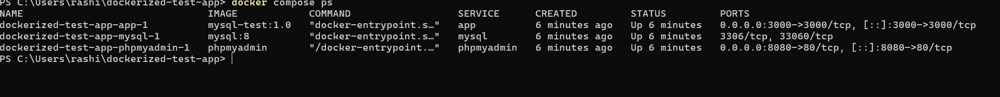
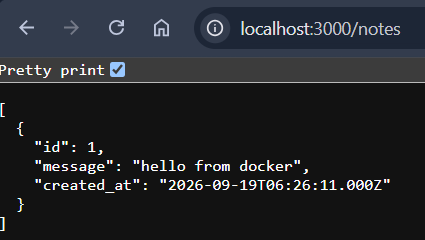
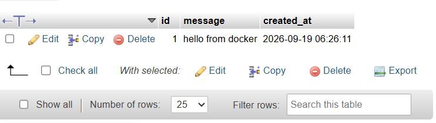

# Dockerized Node.js + MySQL Notes App 🐳

A small Express.js app that stores notes in a MySQL database. The app, the database and phpMyAdmin all run in Docker containers, started together with one Docker Compose command.

## Why I built this

I am learning DevOps, and Docker is one of the core tools. The focus of this project is Docker: the Node.js app is a simple starter that I used to practice containerization, running a multi-container setup with Docker Compose, and connecting an app to a database.

## Tech Stack

- Node.js + Express
- MySQL 8 (`mysql2` driver)
- phpMyAdmin (web UI for the database)
- Docker and Docker Compose

## Services

| Service | URL | Description |
| ------- | --- | ----------- |
| `app` | http://localhost:3000 | Node.js notes API |
| `mysql` | internal only | MySQL 8 database, reachable by the other containers as `mysql` |
| `phpmyadmin` | http://localhost:8080 | Database UI. Log in as `root` with the password set in `docker-compose.yml` |

## API Endpoints

| Method | Endpoint | Description |
| ------ | -------- | ----------- |
| GET | `/` | Health message, confirms the app is running |
| GET | `/notes` | List all notes (newest first) |
| POST | `/notes` | Add a note. Body: `{ "message": "your text" }` |

The `notes` table is created automatically on startup. The app retries the database connection every 3 seconds, so it is fine if MySQL takes a few seconds to be ready.

## Prerequisites

- [Docker](https://docs.docker.com/get-docker/) with Docker Compose
- Git

## How to Run

```bash
git clone https://github.com/<your-username>/<repo-name>.git
cd <repo-name>
docker compose up --build
```

Open `http://localhost:3000` in your browser. ✅

## Try the API

**Linux / macOS / Git Bash:**

```bash
curl -X POST http://localhost:3000/notes \
  -H "Content-Type: application/json" \
  -d '{"message": "hello from docker"}'

curl http://localhost:3000/notes
```

**Windows PowerShell:**

```powershell
Invoke-RestMethod -Method Post -Uri http://localhost:3000/notes -ContentType "application/json" -Body '{"message": "hello from docker"}'

Invoke-RestMethod http://localhost:3000/notes
```

## Useful Commands

```bash
docker compose ps        # see running containers
docker compose logs app  # app logs
docker compose down      # stop everything
docker compose down -v   # stop everything and delete the database data
```

## Configuration

The app reads its database settings from environment variables, which are set in `docker-compose.yml`:

| Variable | Purpose |
| -------- | ------- |
| `MYSQL_HOST` | Database host (the MySQL service name in Compose, `mysql`) |
| `MYSQL_USER` | Database user |
| `MYSQL_PASSWORD` | Database password |
| `MYSQL_DB` | Database name |
| `MYSQL_PORT` | Database port (default `3306`) |
| `PORT` | Port the app listens on (default `3000`) |

The password in this repo is a dummy value for local learning only. Never commit real passwords.

## Screenshots

**Containers running**


**API response**


**Data in phpMyAdmin**


## CI/CD Pipeline

Every push to `main` automatically:
1. Builds the Docker image
2. Pushes it to Docker Hub
3. SSHes into an EC2 instance and redeploys the container

Secrets (Docker Hub token, EC2 SSH key) are managed via GitHub Actions Secrets, never hardcoded.

## What I Learned

- Writing a `Dockerfile` for a Node.js app
- Difference between a Docker image and a container
- Running a multi-container app (app + database + phpMyAdmin) with Docker Compose
- Port mapping and container networking
- Configuring an app with environment variables instead of hardcoding values
- Keeping database data in a Docker volume
- Writing GitHub Actions workflows for CI/CD
- Managing secrets securely in a pipeline
- Deploying to a remote server via SSH

## Known Limitation
Currently the deployed EC2 container runs standalone rather than via Docker Compose, so app-to-database networking on the server needs fixing — works locally with Compose, deploy step is next to align.

## Author

**Rashid**, learning DevOps and backend development.